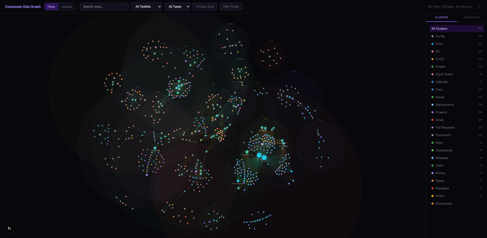
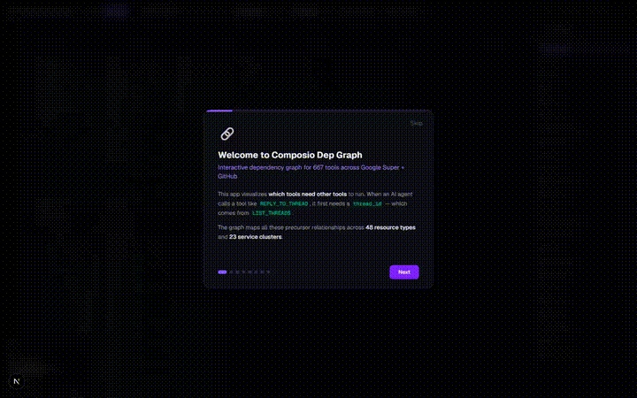
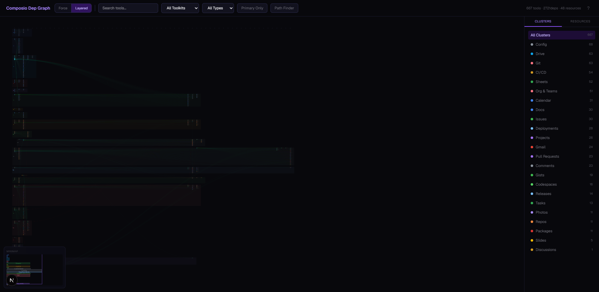
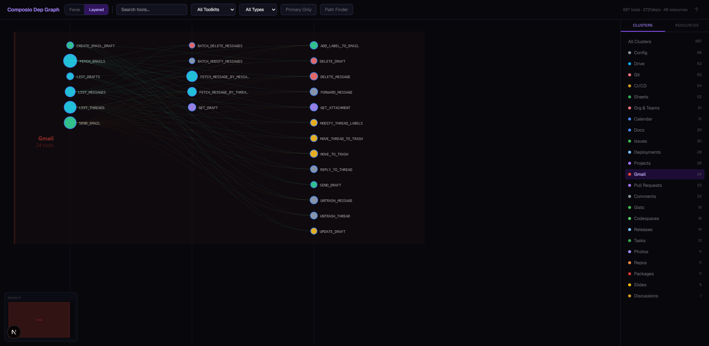
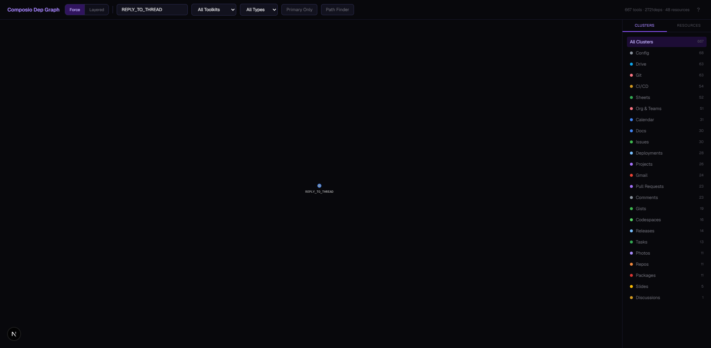
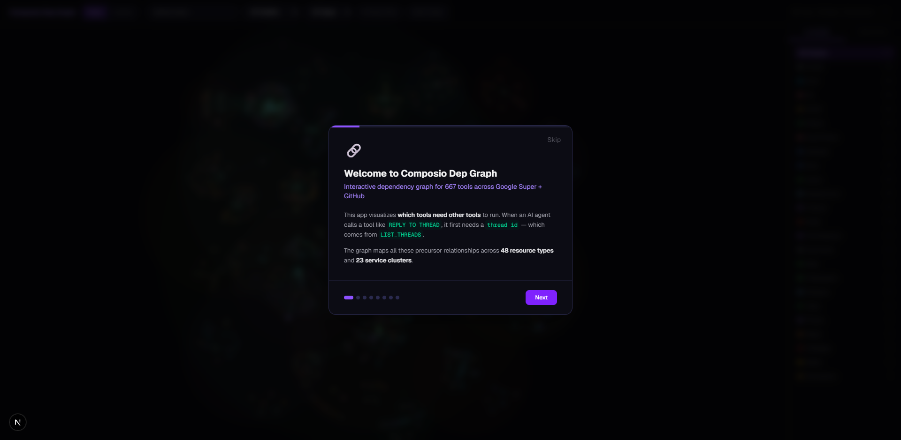

# Composio Tool Dependency Graph

> Interactive dependency graph mapping **667 tools**, **2,721 edges**, and **48 resource types** across Composio's Google Super and GitHub toolkits.

When an AI agent needs to call `REPLY_TO_THREAD`, it first needs a `thread_id` — which comes from `LIST_THREADS`. This project maps **every** such precursor relationship into an explorable, interactive graph.



### Demo



[Download full quality video (mp4)](https://github.com/aptsalt/composio-dep-graph/releases/download/v1.0/demo.mp4)

## What it does

Analyzes all 1,309 raw tool definitions from Composio's API (442 Google Super + 867 GitHub), identifies which tools require outputs from other tools to function, and builds a complete dependency graph.

### Key features

- **48 dependency rules** covering Gmail threads, Calendar events, Drive files, Sheets, Docs, GitHub Issues, Pull Requests, CI/CD workflows, Releases, and more
- **Multi-hop execution chains** — e.g., `DELETE_RELEASE_ASSET` -> `LIST_RELEASE_ASSETS` -> `LIST_RELEASES` (422 tools have depth > 1)
- **Weighted edges** — Primary (recommended), Alternative, and Indirect paths ranked by priority
- **User-providable detection** — distinguishes params the user can type (`calendar_id = "primary"`) from params that require a tool call
- **23 service clusters** — Gmail, Calendar, Drive, Sheets, Docs, Slides, Photos, Tasks, Contacts, Issues, Pull Requests, Git, CI/CD, Releases, Deployments, Gists, Projects, Comments, Discussions, Org & Teams, Config, Codespaces, Packages, Repos

## Interactive Visualization (Next.js + D3)

A full Next.js app with two graph views, filtering, node inspection, and guided onboarding.

### Layered DAG View (default)

Horizontal layout with vertical tier columns. Producers on the left, consumers on the right. Nodes grouped into cluster swim lanes by service area.



### Force-Directed View

Living, breathing D3 force simulation. Nodes cluster organically by service area. Drag nodes to reorganize. The simulation gently breathes — never fully stops.


### Cluster Navigation

Click any cluster to zoom in and lock the highlight. Only that cluster's nodes and edges stay visible.



### Search & Filter

Search by tool name, filter by toolkit (Google/GitHub), category (Retrievers, Creators, Updaters, Deleters), or toggle Primary Only to show recommended paths.



### Guided Onboarding

8-step interactive guide explaining every feature. Shows on first load, reopenable via the ? button.



### Node Detail Panel

Click any node to open a full-height investigation panel with 4 tabs:

| Tab | Description |
|-----|-------------|
| **Overview** | Key dependencies, top consumers, shortest execution chain |
| **Deps** | All dependencies grouped by resource with Primary/Alt/Indirect badges and explanations |
| **Used By** | Consumer tools grouped by cluster, clickable for navigation |
| **Plan** | Full multi-hop execution chains with depth indicators |

Features color-coded parameter badges (green = resolved by dependency, purple = user-providable), quick stats, and tool-to-tool navigation.

## Architecture

```
src/
  index.ts          # Fetches tools from Composio API, applies 48 dependency rules, builds graph
  gen-viz.ts        # Generates static HTML visualization (standalone fallback)

viz/                # Next.js app
  app/page.tsx      # Main page with view switching, filters, state management
  components/
    force-graph.tsx # D3 force-directed simulation on canvas
    dag-view.tsx    # Layered DAG layout with cluster swim lanes + minimap
    node-detail.tsx # 4-tab investigation panel with drill-down navigation
    sidebar.tsx     # Cluster and resource filtering
    toolbar.tsx     # Search, filters, view switcher, controls
    path-finder.tsx # Multi-hop execution plan viewer
    guide-modal.tsx # 8-step onboarding tour
  lib/
    types.ts        # TypeScript types for graph data
    constants.ts    # Colors, cluster mappings, utilities
```

## Quick Start

```bash
# Install dependencies
bun install
cd viz && npm install

# Fetch tools and build graph (uses cached data if available)
bun run src/index.ts

# Run the visualization
cd viz && npm run dev
# Open http://localhost:3000
```

Requires a Composio API key in `.env`:
```
COMPOSIO_API_KEY=your_key_here
```

## Example Dependency Chains

```
REPLY_TO_THREAD
  needs thread_id --> LIST_THREADS (primary)
                  --> FETCH_EMAILS (primary)
                  --> SEND_EMAIL (alt: returns thread of sent msg)

DELETE_RELEASE_ASSET (depth=2)
  needs asset_id --> LIST_RELEASE_ASSETS
                       needs release_id --> LIST_RELEASES (primary)
                                        --> CREATE_A_RELEASE (alt)
                                        --> GET_THE_LATEST_RELEASE (primary)

MERGE_A_PULL_REQUEST
  needs pull_number --> LIST_PULL_REQUESTS (primary)
                    --> FIND_PULL_REQUESTS (primary)
                    --> SEARCH_ISSUES_AND_PULL_REQUESTS (primary)
                    --> CREATE_A_PULL_REQUEST (alt)
```

## Stats

| Metric | Value |
|--------|-------|
| Total tools analyzed | 1,309 |
| Connected tools (with deps) | 667 |
| Dependency edges | 2,721 |
| Resource types | 48 |
| Service clusters | 23 |
| Multi-hop tools | 422 |
| Dependency rules | 48 |
| Max chain depth | 4 |

## Built with

TypeScript, Next.js 16, D3.js 7, Tailwind CSS, Composio API, Bun

---

Built by [Deepak Singh Kandari](https://github.com/aptsalt)
